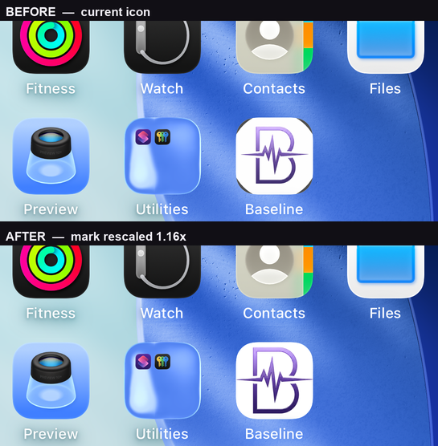
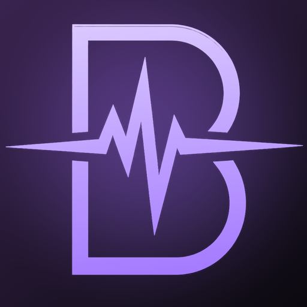
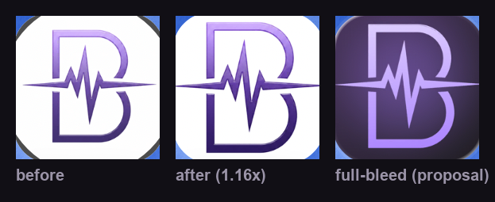

# App icon

The marketing artwork is `Baseline/Assets.xcassets/AppIcon.appiconset/BaselineAppIcon_1024.png`.
It is the only file in the icon set: `actool` derives every other size from it at build time, so there is nothing else to regenerate when the artwork changes.
It must stay fully opaque, because App Store upload validation rejects a binary whose 1024 icon carries an alpha channel.
It must also stay tagged sRGB, so the purple ramp is unambiguous on wide-gamut displays and outside the build, where the marketing 1024 is consumed on its own.
`BaselineTests/AppStoreValidationTests.swift` guards both invariants against the checked-in file, so a bitmap edit that loses either one fails the test suite.

The guards run only with the suite, so after any bitmap edit check both locally first:

```sh
sips -g pixelWidth -g pixelHeight -g hasAlpha -g samplesPerPixel -g profile \
  Baseline/Assets.xcassets/AppIcon.appiconset/BaselineAppIcon_1024.png
# 1024, 1024, hasAlpha: no, samplesPerPixel: 3, profile: sRGB IEC61966-2.1
```

Both invariants are easy to lose by accident, and neither the build nor Xcode warns about the profile.
The rescale that produced the current artwork lost the profile exactly this way: Pillow drops it unless it is passed back explicitly on save, and several image tools will helpfully promote the file to RGBA.
The pixels are already sRGB, so a profile that went missing should be re-tagged rather than converted; a `matchTo`-style conversion would remap the ramp.

## How large the mark can be

The mark is a tall, narrow glyph: the `B` measures 527 x 764 in the 1024 square, an aspect ratio of 0.69.
That ratio, not padding, is what limits how much of the square the mark can occupy.
Scaling it until the `B` is as wide as an Apple icon's glyph would push it far past the top and bottom edges, so the left and right whitespace is structural rather than a margin someone chose.

Two ceilings bound a uniform scale about the centre:

- **1.13x** - beyond this the tapered ends of the ECG flatline (which already spans 88% of the width) reach the edge of the square.
  The taper is under 4px thick there, so crossing this ceiling is invisible at home-screen size.
- **~1.18x** - beyond this the `B` itself runs out of vertical margin.
  On iOS 26 the Liquid Glass edge treatment picks up the ink that now meets the border and smears a dark rim around the whole tile; at 1.20x and above the icon reads visibly dirtier than it did before.

The shipped artwork is **1.16x**, shifted 11px down so the top and bottom margins match.
That was the largest scale that still rendered clean on a real home screen.
It takes the `B` from 51% to 60% of the width and from 75% to 87% of the height, and ink coverage from 15% to 20% of the square.



## The part rescaling does not fix

Rescaling answers "the mark reads small". It does not answer "the mark reads light".
Every neighbouring icon sits on a saturated full-bleed field; Baseline sits on white, with thin gradient line art.
No scale factor changes that, and the glyph's aspect ratio means no scale factor fills the square either.

A full-bleed treatment on the product's own palette does answer both, and would also put the icon in step with the rest of the design system - the app is near-black `#0C0A10` with amethyst `#33203E` and violet `#9B6DFF`, so a white icon is the outlier.
The mock below knocks the mark out in a violet ramp over an amethyst-to-base gradient with a soft ambient glow.





The dark corner arcs on the "before" tile, absent from the other two, are not a masking inconsistency or a doctored comparison: all three tiles are identical 181px crops taken from real springboard screenshots at the same coordinates, and the arcs are iOS 26's Liquid Glass edge treatment reacting differently to the two artworks, which is itself part of what changed.

This is a brand decision, not an implementation one, so it is recorded here as a proposal rather than shipped.
Note that the current artwork is raster, not vector, and no source file exists in the repo; any further change is limited to what can be done to the bitmap until a vector master is produced.

## Reviewing an icon change

Do not judge the 1024 file. Judge the icon at 60pt against real Apple icons:

```sh
xcodegen generate
xcodebuild -project Baseline.xcodeproj -scheme Baseline -configuration Debug \
  -destination 'platform=iOS Simulator,name=iPhone 17 Pro' -derivedDataPath build/DD build
xcrun simctl install <device> build/DD/Build/Products/Debug-iphonesimulator/Baseline.app
xcrun simctl io <device> screenshot before-after.png
```

The springboard applies the mask, the glass edge, and the real scale; nothing rendered offline reproduces all three.
